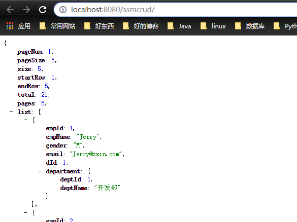
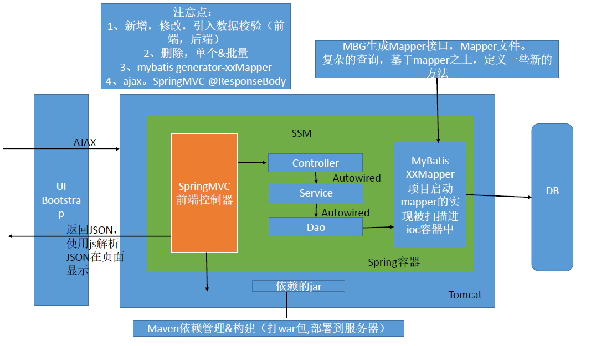

# 项目的注意事项和细节

1)、在逆向工程生成bean之后要 在两个实体类中添加 无参和有参构造方法

2)、在xml中要添加 有部门的 查询，所以要在Employee的实体类中加上一个Department department 的属性

3)、后面改造成 使用ajax的方式 (/web-inf/jsp/list.jsp是弃用的)
* `index.jsp`页面直接发送ajax请求到服务器；
* 服务器接收到ajax请求，进行对应的逻辑处理，返回json字符串给前端；
* 浏览器收到json字符串，使用js对json进行解析，使用js的dom增删改在前端显示；
* 返回json，可以实现客户端的无关性；

4)、注意 要保证 `@ResponseBody`正常工作， 需要导入jackson包，可以将PageInfo自动转换成json

5)、改造之后的结果显示`json`:



6)、前端中，由于每次都是append，所以每次操作之前都需要清空之前显示的数据

7)、前端的分页中，首页和末页，可以在pageHelper中添加一个属性配置，搞定分页的合理化

```xml
<!--配置分页插件-->
<plugins>
    <plugin interceptor="com.github.pagehelper.PageInterceptor">
        <!--分页参数合理化  -->
        <property name="reasonable" value="true"/>
    </plugin>
</plugins>
```

8)、总结

